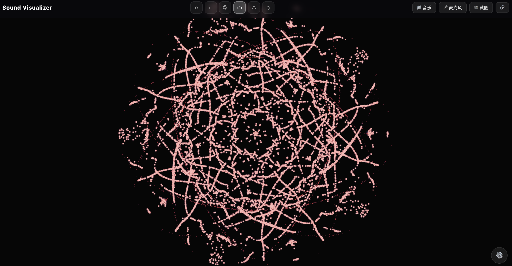
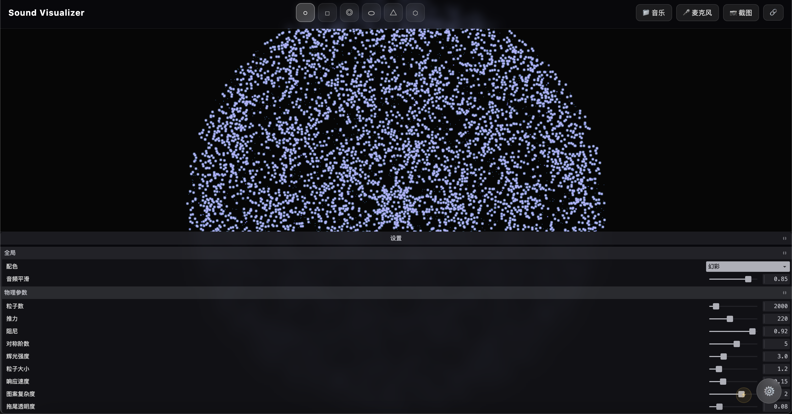
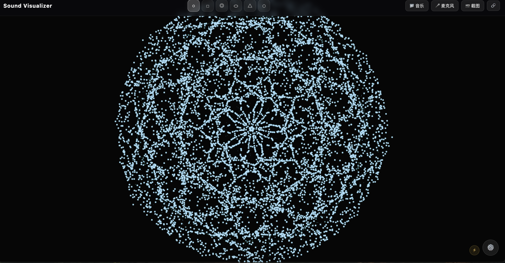

# Sound Visualizer — 克拉尼声纹实验室

浏览器端声音可视化 PWA。将实时音频（麦克风或本地音乐）转化为**数字克拉尼图案**：数千粒子在驻波场中漂移、聚集、结晶，随低频轰鸣与高频碎响变换形态。

 **在线体验**：直接打开 `index.html` 或使用本地服务器运行（见下方）。

---

## ✨ 核心特性

- **六种几何形态**：圆形 · 方形 · 环形 · 椭圆 · 三角形 · 六边形，一键切换
- **实时音频驱动**：支持麦克风输入与本地音乐文件，FFT 峰值自动映射模态参数
- **粒子驻波物理**：波节吸引、波腹排斥、布朗微扰、边界拉回，视觉如沙粒在振动金属板上自然结晶
- **自适应性能**：移动端帧率过低时自动减半粒子数，保证流畅
- **URL 快照分享**：任何时刻的参数组合（形态 / 配色 / 粒子数 / 复杂度）均可编码为链接，复制即还原
- **幻彩 / 固定配色双模式**：暖沙金、霓虹紫、水墨灰、极光绿 + 音频驱动色相漫游

---

## 📸 预览

> 建议在桌面或手机浏览器中打开，配合电子乐或人声体验最佳。

| 驻波形态 1 | 驻波形态 2 | 控制面板 |
|:----------:|:----------:|:--------:|
|  |  |  |

---

## 🚀 使用方法

### 1. 启动

打开页面后选择音频来源：
- **播放本地音乐**：支持 `.mp3` `.wav` `.ogg` `.m4a` 等常见格式
- **使用麦克风**：实时响应环境声 / 乐器 / 人声

### 2. 切换形态

点击顶部工具栏的六个图标，瞬间切换边界几何：

```
○ 圆形   □ 方形   ◎ 环形   ⬭ 椭圆   △ 三角   ⬡ 六边
```

### 3. 调节参数

点击右下角 **⚙️** 打开设置面板：

| 参数 | 作用 |
|------|------|
| 粒子数 | 1000 ~ 8000，越多图案越细腻 |
| 推力 | 驻波场对粒子的驱动强度 |
| 阻尼 | 粒子速度衰减，越高越"粘稠" |
| 响应速度 | 图案随音频变化的速度 |
| 图案复杂度 | 叠加谐波阶数，0 简洁 / 3 繁复 |
| 拖尾透明度 | 背景残留，越低越"拉丝" |
| 辉光强度 | 高堆积区域的泛光 |

### 4. 分享链接

点击顶部 **🔗** 按钮，当前配置（形态、配色、粒子数、复杂度）会被编码到 URL，复制即可分享。

示例：
```
https://your-domain.com/#shape=triangle&theme=aurora&count=3000&complexity=2
```

### 5. 截图

点击 **📷 截图** 保存当前画面为 PNG。

---

## 🛠 技术栈

- **Canvas 2D** — 粒子渲染与拖尾合成
- **Web Audio API** — 实时 FFT 分析、频带能量提取、Onset 检测
- **Tweakpane** — 参数面板（CDN ESM，PWA 预缓存兼容）
- **原生 ES Module** — 无构建工具，零依赖打包

### 音频特征管道

```
AnalyserNode(FFT 2048)
  → 频带能量 [bass / mid / high]
  → 频谱质心（明亮度）
  → Onset 突检测（时域能量差分）
  → FFT 峰值提取（前 3 峰值映射 m/n 模态）
  → EMA 平滑 → 渲染器消费
```

### 渲染管线

```
驻波势场(m, n, complexity) → 数值梯度 → 粒子积分(速度/阻尼/布朗)
  → 边界拉回(形态专属) → Canvas 拖尾合成 → 辉光层叠加
```

---

## 🏃 本地运行

本项目为纯静态文件，无需构建。

```bash
cd sound-visualizer

# 方式一：Python 3
python -m http.server 8080

# 方式二：Node.js
npx serve .

# 方式三：VS Code Live Server 插件
# 直接右键 index.html → Open with Live Server
```

浏览器访问 `http://localhost:8080`。

> **注意**：由于 Web Audio API 的安全策略，页面必须通过 `http://localhost` 或 HTTPS 访问，直接双击 `index.html`（`file://` 协议）会导致音频上下文初始化失败。

---

## 📁 项目结构

```
sound-visualizer/
├── index.html                  # 入口与 UI 骨架
├── css/style.css               # 全屏暗色主题、移动端适配
├── js/
│   ├── app.js                  # 主调度：形态切换、URL 快照、FPS 自适应、Tweakpane
│   ├── audioEngine.js          # 音频引擎：FFT 分析、特征提取、Onset 检测
│   ├── themes.js               # 全局配色表
│   └── renderers/
│       ├── baseRenderer.js     # 渲染器基类
│       └── chladniRenderer.js  # 克拉尼多形态粒子渲染器
├── archive/                    # 废弃实验（光尘/液态/瀑布）
├── assets/                     # 截图与静态资源
├── tests/                      # 视觉与单元测试
├── docs/                       # 技术文档与开发日志
├── PLAN.md                     # 架构与待办
├── SKILL.md                    # 技术规则手册
└── package.json
```

---

## 📝 版本记录

| 版本 | 日期 | 要点 |
|------|------|------|
| v1.0.0 | 2026-06 | 六种形态克拉尼、URL 分享、FPS 自适应、移动端适配、PWA 就绪 |

---

## License

MIT
